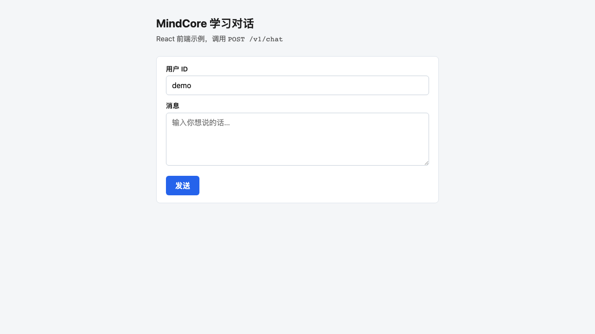
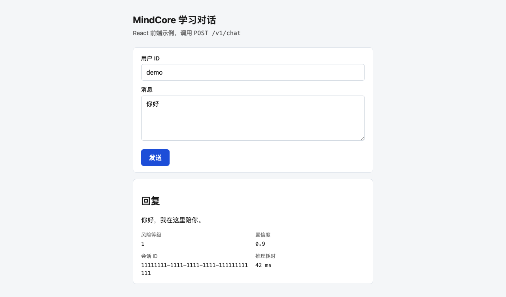
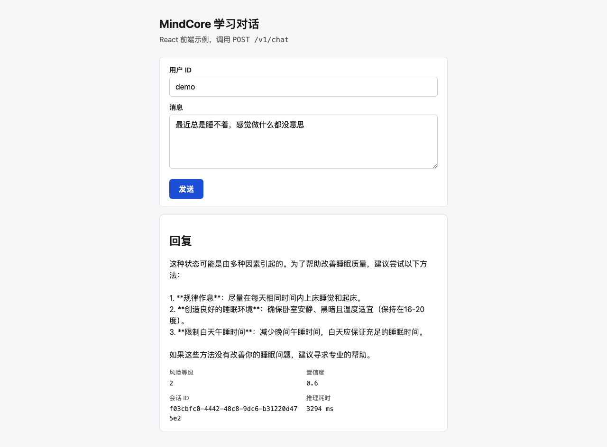

# MindCore

心理健康场景下的 **AI 辅助对话与风险评估** 原型：同步 API（FastAPI）、PostgreSQL 会话与消息、Redis + Celery 异步任务占位；**推理固定为**「关键词风险基线 → Ollama 嵌入 + Qdrant RAG → Ollama `/api/chat` 生成回复」，以及可运行的 HTTP 级 E2E 测试。

> **声明**：本仓库为工程原型，输出不构成医疗诊断或治疗建议。涉及自伤/伤人风险时请接入合规流程与真人专业支持。

## 技术栈

| 组件 | 用途 |
|------|------|
| FastAPI + Uvicorn | HTTP API、`/metrics`（Prometheus 文本） |
| React + Vite | 学习用 Web 前端（`web/`，构建产物由 API 托管） |
| PostgreSQL 15 | 会话、消息、标注任务、模型版本、A/B 配置 |
| Redis 7 | Celery Broker / Result |
| Qdrant | RAG 必选；向量集合默认 `mental_health_knowledge`（`scripts/build_rag_knowledge.py` 写入） |
| Celery | 多模态等异步任务占位（`worker.tasks.process_multimodal`） |

## 环境要求

- Docker / Docker Compose
- [uv](https://docs.astral.sh/uv/)（管理 Python 版本、虚拟环境与依赖锁）
- Python 3.11+（由 `uv` 按 `requires-python` 自动选用，当前环境 3.13 亦可）
- Node.js 18+ 与 npm（构建 `web/` 下 React 前端）
- 项目根目录作为工作目录执行下文命令

## 快速开始

### 1. 启动依赖容器

```bash
docker compose up -d
```

Compose 会一并启动 **Ollama**（本机 `11434`）。首次需拉模型可执行 `./scripts/ensure_ollama_models.sh`。首次启动 Postgres 时会自动执行 `scripts/init_db.sql` 建表与种子数据。

### 2. 安装 uv 与项目依赖

[安装 uv](https://docs.astral.sh/uv/getting-started/installation/) 后，在项目根目录执行：

```bash
# 同步运行时依赖（生成/更新 .venv，并以 uv.lock 为准）
uv sync

# 若需要跑 pytest，一并安装可选开发依赖
uv sync --extra dev
```

依赖声明在 `pyproject.toml`，锁定版本在 `uv.lock`。日常命令优先用 **`uv run …`**，无需手动 `source` 虚拟环境（fish / zsh / bash 行为一致）。

若未安装 uv、仍想用传统 venv，可自行 `python -m venv .venv` 后 `pip install -e ".[dev]"`（不推荐与本仓库文档混用）。

### 3. 环境变量

```bash
cp .env.example .env
```

按需修改数据库、Redis、Qdrant 与推理相关变量（见下文「环境变量」）。

### 4. 构建 React 前端

API 根路径 `/` 托管前端构建产物（`web/dist`）。首次或修改前端后需执行：

```bash
cd web
npm install
npm run build
cd ..
```

开发时可单独起 Vite 热更新（`/v1` 代理到本机 API）：

```bash
# 终端 A：API
uv run uvicorn api.main:app --host 127.0.0.1 --port 8000 --reload

# 终端 B：前端
cd web && npm run dev
```

浏览器打开 [http://127.0.0.1:5173](http://127.0.0.1:5173) 开发；生产式联调打开 [http://127.0.0.1:8000/](http://127.0.0.1:8000/)（需已 `npm run build`）。

### 5. 启动 API

```bash
uv run uvicorn api.main:app --host 127.0.0.1 --port 8000 --reload
```

浏览器打开 [http://127.0.0.1:8000/docs](http://127.0.0.1:8000/docs) 查看 OpenAPI；学习页为 [http://127.0.0.1:8000/](http://127.0.0.1:8000/)。

**说明**：`uvicorn` / `celery worker` 是**常驻进程**，会一直占用当前终端；若把「起服务 + 跑脚本 + 跑 pytest」写在一条命令里且不放到后台，看起来会像**卡死**。开发时建议：

- **两个终端**：一个专门跑 `uv run uvicorn`（或 `uv run celery`），另一个跑 `curl` / `uv run pytest`；
- **或后台启动 API**（项目内脚本，日志在 `logs/api.log`，PID 在 `logs/api.pid`）：

```bash
./scripts/dev_api_background.sh
# 结束：./scripts/dev_api_stop.sh
```

### 6.（可选）启动 Celery Worker

```bash
uv run celery -A worker.celery_app worker --loglevel=info
```

同样需要**单独终端**或自行 `nohup ... &` 放到后台，否则会一直阻塞在该命令。

### 7. 写入 Qdrant 知识（API 联调前建议完成）

推理会**始终**对 `QDRANT_RAG_COLLECTION` 做嵌入检索；集合需已存在且与 **`OLLAMA_EMBED_MODEL` 建库时一致**。需容器 `qdrant` 与 Ollama 已运行：

```bash
uv run python scripts/build_rag_knowledge.py
```

### 8.（可选）主动学习脚本

根据消息置信度与风险筛选样本并写入 `annotation_tasks`：

```bash
uv run python scripts/active_learning.py
```

## 全链路概览

从浏览器或 `curl` 发消息，到拿到 LLM 回复，链路如下：

```
React 页 / curl
    → POST /v1/chat（FastAPI）
    → PostgreSQL 会话/消息落库
    → 关键词风险基线
    → Ollama 嵌入 + Qdrant RAG 检索
    → Ollama 对话生成 reply
    → JSON 返回（含 risk_level、confidence）
```

**学习页入口**：[http://127.0.0.1:8000/](http://127.0.0.1:8000/)（需已 `npm run build` 且 API 在跑）

### 一键验证全链路

依赖（Postgres、Qdrant、Ollama、RAG 集合、API、前端构建）就绪后：

```bash
./scripts/run_full_e2e.sh
```

脚本依次执行：API 健康检查 → 真实 `/v1/chat` smoke → HTTP E2E（5 项）→ Playwright（7 项，含 UI 截图）。

首次跑 Playwright 需安装浏览器：

```bash
uv run playwright install chromium
```

### 网络代理（拉 Ollama 模型）

若需代理访问外网（例如 Clash `7890` 端口），在**拉模型**的终端设置：

```bash
export http_proxy=http://127.0.0.1:7890
export https_proxy=http://127.0.0.1:7890
./scripts/ensure_ollama_models.sh
```

注意：`http_proxy` 主机名请写 **`localhost` 或 `127.0.0.1`**，拼写错误（如 `locahost`）会导致 Ollama 拉取失败。本机 API / Qdrant 请求不受此影响；pytest 已对 localhost 关闭代理（`trust_env=False`）。

### 不用 Docker 的本地最小栈（可选）

若 `docker compose` 拉镜像困难，可仅用本机 Postgres + 项目内二进制：

```bash
# Qdrant（首次需下载二进制到 .local/bin/qdrant，见 release）
QDRANT__STORAGE__STORAGE_PATH=$PWD/.local/qdrant_storage .local/bin/qdrant &

# Ollama（Homebrew 或 .local/ollama；拉模型时挂代理）
brew services start ollama   # 或 ollama serve

# 建 RAG、起 API、构建前端（见上文各步）
OLLAMA_BASE_URL=http://127.0.0.1:11434 uv run python scripts/build_rag_knowledge.py
cd web && npm run build && cd ..
uv run uvicorn api.main:app --host 127.0.0.1 --port 8000 --reload
```

`.env` 中 `OLLAMA_BASE_URL`、`DATABASE_URL` 须与实际端口一致。

## HTTP 接口摘要

| 方法 | 路径 | 说明 |
|------|------|------|
| GET | `/health` | 进程存活；JSON 中 `status` 为 `ok` |
| GET | `/ready` | 数据库连通性 |
| GET | `/metrics` | Prometheus 指标 |
| POST | `/v1/chat` | 创建或延续会话，返回回复与风险等级等；未配置集合、RAG 失败或 Ollama 不可用时为 **503** |

### `POST /v1/chat` 示例

```bash
curl -s -X POST http://127.0.0.1:8000/v1/chat \
  -H "Content-Type: application/json" \
  -d '{"user_id":"demo","message":"最近总是睡不着，感觉做什么都没意思"}'
```

请求体字段：`user_id`（必填）、`message`（必填）、`session_id`（可选，UUID）、`audio_url`（可选）。

## 本地 LLM、LangChain 与 Qdrant RAG（ARM Mac Studio）

- **推理流水线（固定）**：`services/inference.py` 中 `infer()` 顺序为：**①** `_baseline_risk_and_confidence`（关键词风险 / 置信度）→ **②** Ollama **`/api/embeddings`** + Qdrant **`search`**（`retrieve_rag_context`）→ **③** Ollama **`/api/chat`** 生成 `reply`。无远程 `INFERENCE_URL` 分支，无关键词模板回退；任一步失败则 `POST /v1/chat` 返回 **503**（`InferenceUnavailableError`）。未配置 `QDRANT_RAG_COLLECTION`（空字符串）也会在推理入口直接失败。
- **是否还要关键字**：**风险等级与 confidence** 仍来自关键词启发式，在 **RAG 与对话模型调用之前** 即算好，与 LLM 输出无关。
- **Ollama 和 LangChain 选哪个**：不是二选一。**Ollama** 负责在本机拉模型、嵌入与对话（Apple Silicon / Metal 上体验好）。**LangChain**（或 LangGraph）是编排框架；本仓库用 **`httpx` 调 Ollama HTTP API** 与 **`qdrant-client`** 检索，需要时可在独立模块引入 LangChain。
- **模型放容器里还是宿主机**：默认 **`docker compose up -d` 会起 Compose 内 Ollama**（`11434` 映射到本机）。在 Mac Studio 上若要用 **宿主机 Ollama（Metal）**，请先停掉 Compose 里的 `ollama` 服务或改端口，避免与本机 `11434` 冲突；Metal 路径下仍设 `OLLAMA_BASE_URL=http://127.0.0.1:11434` 即可。
- **小模型 / 弱机器**：对话模型由 **`OLLAMA_CHAT_MODEL`** 决定；嵌入由 **`OLLAMA_EMBED_MODEL`** 决定（RAG 与 `build_rag_knowledge` 必须一致）。仓库默认对话 **`qwen2.5:0.5b-instruct-q2_K`**、嵌入 **`nomic-embed-text`**（768 维）。这与论文里的 **1-bit 权重架构**（如 BitNet 路线）不是同一概念。
- **和 Qdrant 怎么对齐**：写入与查询必须用**同一嵌入模型**。推荐流程：1）`docker compose up -d` 启动 Qdrant 与 Ollama，并拉好嵌入/对话模型；2）设置 `OLLAMA_BASE_URL`，执行 `uv run python scripts/build_rag_knowledge.py`；3）在 `.env` 中设置 `OLLAMA_*` 与 `QDRANT_RAG_COLLECTION`（默认见 `api/config.py` / `.env.example`）；4）启动 API。
- **延迟**：`inference_time_ms` 为整次 `infer()` 墙钟时间，**含** 嵌入请求、Qdrant 检索与 `/api/chat` 生成（串行），通常高于「仅对话、无 RAG」的配置。

### RAG 与本项目行为说明（概念）

- **「让大模型读向量库」**：实际上大模型**不会**去连 Qdrant。做法是**应用层**用向量库做检索，把命中的**文本片段**写进给模型的**提示词**（这里是 `system`），模型再基于「用户原话 + 这些片段」生成回答。这就是常见 **RAG**：检索和生成分开，模型读的是**文字上下文**，不是向量 API。
- **「回复走大模型」**：`reply` **始终**来自 Ollama `/api/chat`；Qdrant 检索结果只写入 **`system`** 侧提示，模型不直连向量库。
- **「用户直接用向量库」**：当前对外只有 `POST /v1/chat`，没有把 Qdrant 暴露给终端用户，用户也不能直接查向量库。

### 风险等级、置信度与 `model_version`（实现与设计说明）

`/v1/chat` 返回并在 PostgreSQL `messages` 中落库的 **`risk_level`、`confidence`** 来自 `services/inference.py` 中的 **`_baseline_risk_and_confidence`**：在 **嵌入、Qdrant 与 Ollama 对话之前**即确定——统计用户 `message` 命中预置关键词列表的个数（每个词至多计一次），再限制在 1～5；若 `risk_level` 为 1 或 5 则 `confidence` 为 `0.9`，否则为 `0.6`。二者均为**与模型输出无关的规则值**，不是分类器或 LLM 的概率。

- **`model_version`**：成功时为 `ollama:<OLLAMA_CHAT_MODEL>`；并非从权重文件读取的语义化版本。
- **`inference_time_ms`**：整次 `infer()` 的墙钟耗时，**含** Ollama 嵌入、Qdrant 检索与 `/api/chat`（不包含 FastAPI 里会话校验与写库的耗时）。

**为何不用向量数据库做风险**：Qdrant 在本项目中的职责是 **RAG 检索**（把语义相近的知识片段拼进提示词），与风险打分是**两条链路**。用向量库做风险需要另行设计（例如与参考语料相似度或专用向量分类），当前仓库未实现；关键词基线是**低成本、行为可预期的占位实现**，便于原型联调与落库、`annotation_tasks` 等下游逻辑。

**是否应改为模型推理**：若 `risk_level` / `confidence` 用于真实分流、告警或人工介入，更合理的方向是 **专用风险/危机意念分类模型**、经评估的 **结构化 LLM 输出**（配合校验与人工复核），而非当前启发式。关键词易漏检、误报，且与「置信度」的常规定义不一致；扩展前请明确合规与产品流程。

## 环境变量

| 变量 | 说明 |
|------|------|
| `DATABASE_URL` | AsyncPG 连接串，默认指向本机 Compose 中的 Postgres |
| `REDIS_URL` | 预留，供后续缓存或任务扩展 |
| `CELERY_BROKER_URL` / `CELERY_RESULT_BACKEND` | Celery 使用 |
| `QDRANT_HOST` / `QDRANT_PORT` | Qdrant 地址；`build_rag_knowledge.py` 与 RAG 检索共用 |
| `OLLAMA_BASE_URL` | **默认** `http://127.0.0.1:11434`；嵌入与对话均走该 Ollama |
| `OLLAMA_CHAT_MODEL` | 对话模型名，默认 `qwen2.5:0.5b-instruct-q2_K`（须与 `ollama list` 一致） |
| `OLLAMA_EMBED_MODEL` | 嵌入模型，默认 `nomic-embed-text`（与 RAG 检索、`build_rag_knowledge` 建库须一致） |
| `QDRANT_RAG_COLLECTION` | **必填**（勿设为空）：检索所用集合名，默认 `mental_health_knowledge` |
| `QDRANT_RAG_TOP_K` | 检索条数，默认 `3` |
| `OLLAMA_CHAT_TIMEOUT_SEC` / `OLLAMA_EMBED_TIMEOUT_SEC` | `<=0` 表示不限制超时（见 `api/config.py`） |
| `INFERENCE_DEBUG_LOG` | `true` 时打印 RAG 与 Ollama chat 请求等（含用户正文，仅排障） |

## 测试

### 一键全链路（推荐）

```bash
./scripts/run_full_e2e.sh
```

### 分步执行

真实对话 smoke（需 Ollama + Qdrant + RAG + API）：

```bash
./scripts/smoke_chat.sh
```

```bash
# 单元测试（不依赖容器）
uv run pytest tests/test_inference.py -q

# HTTP E2E（需 API 已运行）
uv run pytest tests/test_e2e_api.py -v

# 前端 Playwright + UI 截图（首次会自动 npm install && npm run build）
uv run playwright install chromium
uv run pytest tests/test_frontend_playwright.py -v --browser chromium
```

### Playwright 截图

测试会把页面截图写入 `docs/screenshots/`：

| 文件 | 说明 |
|------|------|
| `learn-initial.png` | 初始页 |
| `learn-with-reply.png` | Mock API 回复后 |
| `learn-live-reply.png` | **真实** Ollama 对话回复后 |







自定义 API 地址：

```bash
MINDCORE_E2E_BASE_URL=http://127.0.0.1:8080 ./scripts/run_full_e2e.sh
```

## 仓库结构（节选）

```
api/                 # FastAPI 应用与配置
web/                 # React + Vite 学习页（npm run build → dist/）
docs/screenshots/    # Playwright 生成的 UI 截图
services/            # 推理流水线（Ollama 嵌入 + Qdrant + Ollama 对话）
worker/              # Celery 应用与任务
scripts/             # 初始化 SQL、RAG 构建、全链路 E2E（run_full_e2e.sh）
tests/               # 单元测试与 E2E
pyproject.toml       # 项目与依赖声明（uv）
uv.lock              # 依赖锁定（提交到仓库）
docker-compose.yml
```

## 与需求文档的关系

更完整的产品形态（Kafka、Airflow、vLLM/MLX 独立服务、K8s 等）见仓库内 `req.txt` 中的架构说明；本仓库当前实现为可本地跑通的最小闭环，便于迭代 API 与数据模型。

## 许可证

本项目以 [MIT License](LICENSE) 发布（Copyright (c) 2026 liweinan）。
