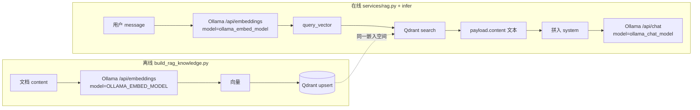

# RAG 与 Qdrant：嵌入模型一致性与本仓库实现

本文说明：**向量检索要求「建库」与「查询」使用同一嵌入模型**（同一向量空间）；并说明 MindCore 中 **如何将嵌入与 Qdrant 写入/检索结合**。语义辨析亦见 `docs/draft.txt`（向量是语义坐标而非文本身份证、不同模型不可混比）。

---

## 1. 两个「模型」角色不同

| 类型 | 配置项 | 典型用途 | 与 Qdrant 的关系 |
|------|--------|----------|------------------|
| **嵌入模型** | `OLLAMA_EMBED_MODEL`（脚本）/ `ollama_embed_model`（`api.config`） | `POST .../api/embeddings`，产出查询向量或文档向量 | **必须与集合建库时用的嵌入模型一致**，否则近邻无意义 |
| **对话模型** | `OLLAMA_CHAT_MODEL` / `ollama_chat_model` | `POST .../api/chat`，生成 `reply` | **不要求**与嵌入模型同名；与 Qdrant 无直接向量运算 |

默认在 `api/config.py` 中为：`nomic-embed-text`（嵌入）与 `qwen2.5:0.5b-instruct-q2_K`（对话），二者独立。

```13:18:api/config.py
    ollama_base_url: str = "http://127.0.0.1:11434"
    ollama_chat_model: str = "qwen2.5:0.5b-instruct-q2_K"
    ollama_embed_model: str = "nomic-embed-text"
    qdrant_host: str = "localhost"
    qdrant_port: int = 6333
```

---

## 2. 离线：用嵌入模型生成向量并写入 Qdrant

脚本 `scripts/build_rag_knowledge.py` 在配置了 **`OLLAMA_BASE_URL`** 时，对每条文档的 `content` 调用 Ollama **`/api/embeddings`**，使用环境变量 **`OLLAMA_EMBED_MODEL`**（默认 `nomic-embed-text`），得到与线上一致的向量空间。

核心步骤：

1. **`ollama_embed_text`**：HTTP `POST {base}/api/embeddings`，body 为 `{"model": embed_model, "prompt": text}`，取返回的 `embedding` 数组。
2. **`recreate_collection`**：按首条向量长度设置 `VectorParams.size`，距离为 **Cosine**。
3. **`upsert`**：每个点包含 `vector` 与 `payload`（含 `content`、`embedding_model` 等元数据）。

```72:102:scripts/build_rag_knowledge.py
    if use_ollama:
        vectors = [ollama_embed_text(doc["content"], ollama_base, embed_model) for doc in documents]
        dim = len(vectors[0])
        embed_label = embed_model
    else:
        vectors = [deterministic_unit_vector(i + 1) for i in range(len(documents))]
        dim = VECTOR_DIM
        embed_label = "deterministic-seed"

    client.recreate_collection(
        collection_name=COLLECTION_NAME,
        vectors_config=VectorParams(size=dim, distance=Distance.COSINE),
    )

    points: list[PointStruct] = []
    for index, doc in enumerate(documents):
        points.append(
            PointStruct(
                id=str(uuid.uuid5(uuid.NAMESPACE_URL, f"mindcore:{index}")),
                vector=vectors[index],
                payload={
                    "chunk_type": doc["chunk_type"],
                    "source": doc["source"],
                    "tags": doc["tags"],
                    "content": doc["content"],
                    "embedding_model": embed_label,
                },
            )
        )

    client.upsert(collection_name=COLLECTION_NAME, points=points)
```

**未设置 `OLLAMA_BASE_URL` 时**：脚本走 **确定性伪向量**（`deterministic_unit_vector`），与真实 Ollama 嵌入 **不在同一语义空间**，仅作占位；此时若线上仍用真实嵌入去搜，**无法**与建库数据正确匹配。

---

## 3. 在线：同一嵌入模型对用户输入编码并在 Qdrant 中检索

`services/rag.py` 中 **`retrieve_rag_context`**：

1. 用 **`ollama_embed`** 对 **用户当前整句 `query`（即 `message`）** 调用同一接口 `/api/embeddings`，`model` 为调用方传入的 `embed_model`。
2. 使用得到的 **`query_vector`** 调用 `QdrantClient.search`（`limit=top_k`，`with_payload=True`）。
3. 从命中结果的 `payload["content"]` 拼成文本块，供 `infer()` 写入 **system** 提示，再交给 **聊天模型**（与嵌入无关）。

```19:62:services/rag.py
async def ollama_embed(client: httpx.AsyncClient, base_url: str, model: str, text: str) -> list[float]:
    url = f"{base_url.rstrip('/')}/api/embeddings"
    response = await client.post(url, json={"model": model, "prompt": text})
    response.raise_for_status()
    payload: dict[str, Any] = response.json()
    embedding = payload.get("embedding")
    if not isinstance(embedding, list):
        raise RuntimeError("Ollama 返回中缺少 embedding 数组")
    return [float(x) for x in embedding]


async def retrieve_rag_context(
    *,
    query: str,
    ollama_base_url: str,
    embed_model: str,
    qdrant_host: str,
    qdrant_port: int,
    collection: str,
    top_k: int,
) -> str:
    if not collection.strip():
        return ""
    async with httpx.AsyncClient(
        timeout=OLLAMA_EMBED_CLIENT_TIMEOUT_SEC,
        trust_env=False,
    ) as http_client:
        vector = await ollama_embed(http_client, ollama_base_url, embed_model, query)
    ...
    client = QdrantClient(host=qdrant_host, port=qdrant_port)
    hits = client.search(
        collection_name=collection,
        query_vector=vector,
        limit=top_k,
        with_payload=True,
    )
```

`services/inference.py` 在 Ollama 路径下从配置读取 **`ollama_embed_model`**、**`qdrant_rag_collection`** 等，并传入 `retrieve_rag_context`；**仅当 `qdrant_rag_collection` 非空** 时才执行 RAG。

```108:127:services/inference.py
    ollama_base = cfg.ollama_base_url.rstrip("/")
    chat_model = cfg.ollama_chat_model.strip()
    embed_model = cfg.ollama_embed_model.strip()
    collection = (cfg.qdrant_rag_collection or "").strip()
    top_k = cfg.qdrant_rag_top_k
    allow_fallback = cfg.use_template_fallback

    try:
        rag_block = ""
        if collection:
            try:
                rag_block = await retrieve_rag_context(
                    query=message,
                    ollama_base_url=ollama_base,
                    embed_model=embed_model,
                    qdrant_host=cfg.qdrant_host,
                    qdrant_port=cfg.qdrant_port,
                    collection=collection,
                    top_k=top_k,
                )
```

**远程推理分支**（`INFERENCE_URL` 且 `USE_MOCK_INFERENCE=false`）：当前实现 **不调用** `retrieve_rag_context`，即无嵌入与 Qdrant 参与。

---

## 4. 「匹配」在工程上的含义

- Qdrant 做的是 **查询向量与已存向量的近邻搜索**（余弦空间内）。「匹配」指：**查询向量与文档向量由同一嵌入模型生成**，语义相近的文本在空间中靠近，检索才有意义。
- 本仓库 **不会**在运行时校验「集合是否由当前 `ollama_embed_model` 建库」；需运维上保证：
  - 建库脚本与 API 使用 **同一 `OLLAMA_BASE_URL`（或等价可达的 Ollama）** 与 **同一嵌入模型名**；
  - `QDRANT_RAG_COLLECTION` 指向该次 `upsert` 的集合名（默认脚本为 `mental_health_knowledge`）。

---

## 5. 更换嵌入模型时

更换嵌入模型会改变向量维度与语义空间，需：

1. 用新模型对 **全部文档** 重新编码；
2. **重建或新建** Qdrant collection（`recreate_collection` 或新集合名 + 切换配置）；
3. 更新配置中的 **`ollama_embed_model`** / **`OLLAMA_EMBED_MODEL`**，与 **`payload.embedding_model`** 等业务记录保持一致。

---

## 6. 流程简图（Mermaid）



---

## 本地验证（可复现）

以下步骤用于核对本文与代码行为一致（需在项目根目录、已安装依赖，且 **Ollama 已拉取** `OLLAMA_EMBED_MODEL` 与 `OLLAMA_CHAT_MODEL`，可用 `./scripts/ensure_ollama_models.sh`）。

### 1. 启动依赖

```bash
docker compose up -d postgres redis qdrant ollama
```

确认 `curl -s http://127.0.0.1:11434/api/tags` 能列出模型。

### 2. 建库（真实嵌入，与线上一致）

```bash
export OLLAMA_BASE_URL=http://127.0.0.1:11434
export OLLAMA_EMBED_MODEL=nomic-embed-text
export QDRANT_HOST=localhost
export QDRANT_PORT=6333
uv run python scripts/build_rag_knowledge.py
```

预期日志含：`已写入 3 条向量到 mental_health_knowledge（Ollama 嵌入 (nomic-embed-text)，维度 768）`（条数随脚本内示例文档数量变化）。

### 3. 验证检索链（仅 `retrieve_rag_context`）

```bash
export PYTHONPATH="$(pwd)"
export INFERENCE_DEBUG_LOG=false
.venv/bin/python -c "
import asyncio
from services.rag import retrieve_rag_context
async def main():
    ctx = await retrieve_rag_context(
        query='我感到抑郁',
        ollama_base_url='http://127.0.0.1:11434',
        embed_model='nomic-embed-text',
        qdrant_host='localhost',
        qdrant_port=6333,
        collection='mental_health_knowledge',
        top_k=3,
    )
    assert '知识片段' in ctx
    print(ctx[:400])
asyncio.run(main())
"
```

应打印以「以下是与用户问题相关的知识片段」开头的若干条 `payload.content` 文本。

### 4. 验证完整 `infer()`（嵌入 + Qdrant + `/api/chat`）

```bash
export PYTHONPATH="$(pwd)"
export INFERENCE_DEBUG_LOG=false
export QDRANT_RAG_COLLECTION=mental_health_knowledge
export OLLAMA_BASE_URL=http://127.0.0.1:11434
export OLLAMA_EMBED_MODEL=nomic-embed-text
export QDRANT_HOST=localhost
export QDRANT_PORT=6333
export INFERENCE_URL=
export USE_MOCK_INFERENCE=true
.venv/bin/python -c "
import asyncio
from services.inference import infer
async def main():
    r = await infer('你好', '00000000-0000-0000-0000-000000000001')
    print(r['model_version'], r['reply'][:120])
asyncio.run(main())
"
```

`model_version` 应为 `ollama:<OLLAMA_CHAT_MODEL 值>`。**首轮**拉取/加载聊天模型时 `/api/chat` 可能耗时 **数分钟**，属正常现象。验证检索不必等待聊天：可只做第 3 步。

### 5. 单元测试

```bash
uv run pytest tests/test_inference.py -q
```

### 排障说明

- `INFERENCE_DEBUG_LOG=true` 时会在日志中输出**整段嵌入向量 JSON**，体积大，仅排障使用；日常验证建议 **`INFERENCE_DEBUG_LOG=false`**。
- 若 `OLLAMA_BASE_URL` 未设置即运行建库脚本，会得到**伪向量**集合，与线上一致嵌入检索**不兼容**（见上文「未设置 `OLLAMA_BASE_URL`」）。

---

## 相关文件

| 说明 | 路径 |
|------|------|
| 嵌入与 Qdrant 检索 | `services/rag.py` |
| 推理中调用 RAG | `services/inference.py` |
| 示例建库 | `scripts/build_rag_knowledge.py` |
| 默认模型与 Qdrant 连接 | `api/config.py` |
| 向量语义概念补充 | `docs/draft.txt` |
| 端到端数据流说明 | `docs/technical-analysis-data-rag.md` |
