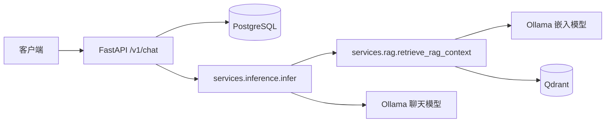
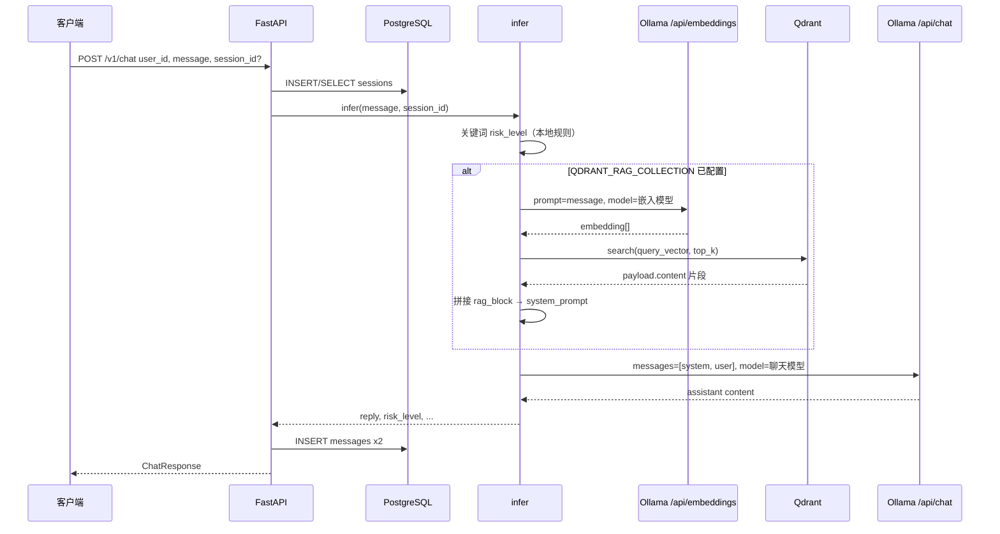
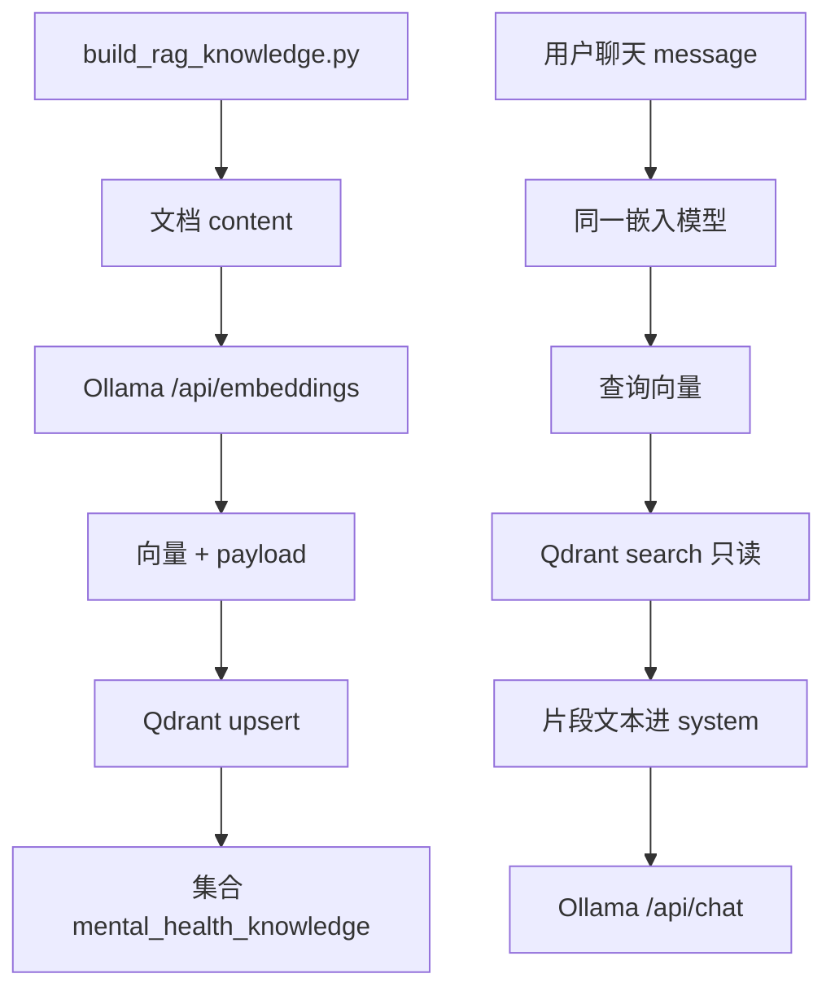

# MindCore 技术分析：会话存储、向量与 RAG 流程

本文描述仓库**当前实现**（以 `api/main.py`、`services/inference.py`、`services/rag.py`、`scripts/build_rag_knowledge.py`、`scripts/init_db.sql` 为准）。声明：本系统为原型，输出不构成医疗诊断。

---

## 1. PostgreSQL 如何存储用户会话

### 表结构

- **`sessions`**：一条记录对应一个会话。
  - `id`：UUID，主键；客户端可在后续请求中携带同一 `session_id` 以延续会话。
  - `user_id`：调用方传入的用户标识（最长 64 字符）。
  - `created_at` / `ended_at`：创建时间；结束时间可为空。
  - `metadata`：JSONB，默认 `{}`，便于扩展业务字段。

- **`messages`**：会话内的每条消息一行，通过 `session_id` 外键关联 `sessions(id)`，级联删除。
  - `role`：`user` 或 `assistant` 等。
  - `content`：文本内容。
  - 用户消息可带 `risk_level`、`confidence`（来自关键词基线，非模型概率）；助手消息带 `model_version`、`inference_time_ms` 等。

建表语句见 `scripts/init_db.sql` 中 `sessions` 与 `messages` 定义。

### API 层行为（`POST /v1/chat`）

- **未传 `session_id`**：生成新 UUID，向 `sessions` **插入**一行 `(id, user_id, metadata='{}')`。
- **传入 `session_id`**：先 **查询** `sessions` 是否存在该 `id`；不存在则返回 404。
- 推理完成后，在同一事务中 **插入两条 `messages`**：一条用户消息（含 `risk_level`、`confidence` 等），一条助手回复（含 `model_version`、`inference_time_ms`）。

会话与消息的持久化**不依赖**向量库；PostgreSQL 仅存储结构化会话与文本。

---

## 2. 如何使用向量模型对用户输入做「向量分析」

在线 RAG 路径中，**不会**把用户消息以「分析结论」形式单独落库；而是把用户当前 **`message` 整段文本** 作为 **查询句**，调用 Ollama 的嵌入接口得到一条查询向量。

- **HTTP**：`POST {OLLAMA_BASE_URL}/api/embeddings`
- **请求体**：`{"model": <嵌入模型名>, "prompt": <用户 message>}`
- **响应**：`embedding` 浮点数组（例如 `nomic-embed-text` 为 **768 维**）。

实现见 `services/rag.py` 中的 `ollama_embed` 与 `retrieve_rag_context`：先嵌入，再拿该向量去 Qdrant 检索。

**前提**：`QDRANT_RAG_COLLECTION` 非空且集合已用**同一嵌入模型**建库；否则 `infer()` 中可能跳过 RAG 或检索无意义（若曾用伪向量建库则与 Ollama 嵌入不一致）。

---

## 3. 向量结果如何进入 Qdrant（建库 vs 在线请求）

需区分两条路径，避免混淆「写入集合」与「用向量搜索」。

### 建库写入（离线脚本）

`scripts/build_rag_knowledge.py`：

1. 对每条知识文档的 `content` 调用同一 Ollama `/api/embeddings`（或与线上一致的模型），得到向量。
2. 使用 `QdrantClient.recreate_collection` 创建/覆盖集合 `mental_health_knowledge`（默认名，与脚本中 `COLLECTION_NAME` 一致），距离度量 **Cosine**。
3. 使用 `upsert` 写入 `PointStruct`：`vector` 为嵌入向量，`payload` 含 `content`、`tags`、`source`、`embedding_model` 等。

此处是**把知识片段的向量持久化到 Qdrant**，不是把「用户每句话」写入 Qdrant。

### 在线请求（检索）

用户发聊天时：**不**向 Qdrant 新增用户向量文档；仅将 **查询向量** 作为 `client.search(..., query_vector=vector)` 的输入，在已有集合上做近邻搜索。

---

## 4. Qdrant 如何搜索；结果如何与查询一并交给聊天大模型；涉及哪两个模型

### 搜索

`services/rag.py` 中 `QdrantClient.search`：

- `collection_name`：配置的集合名（如 `mental_health_knowledge`）。
- `query_vector`：上一步对用户 `message` 嵌入得到的向量。
- `limit`：`qdrant_rag_top_k`（默认 3）。
- `with_payload=True`：取回 payload 中的文本字段。

从命中点的 `payload["content"]` 拼接成一段 **纯文本** `rag_block`（带简短中文说明前缀），**不是**把向量传给大模型。

### 与聊天大模型结合

`services/inference.py`（Ollama 分支，且未走 `INFERENCE_URL` 远程推理时）：

1. 构造 `system_prompt`：固定角色与会话 id 说明；若 `rag_block` 非空则 **追加**在 system 中。
2. 构造 `messages`：`system` + `user`（**用户原始 `message` 原文**，未经向量替换）。
3. `POST {OLLAMA_BASE_URL}/api/chat`，请求体含 `model`（聊天模型）、上述 `messages`、`options`（如 `temperature`）。

大模型看到的是 **自然语言**：系统提示里的「知识片段」列表 + 用户原话；**不**直接读取 Qdrant 或向量数组。

### 两个大模型（Ollama 上的两个不同用途）

| 用途 | 配置项（默认示例） | 调用接口 | 在流程中的角色 |
|------|-------------------|----------|----------------|
| **嵌入 / 向量** | `OLLAMA_EMBED_MODEL`，如 `nomic-embed-text` | `/api/embeddings` | 将用户查询与建库文档映射到同一向量空间，供 Qdrant 检索 |
| **对话生成** | `OLLAMA_CHAT_MODEL`，如 `qwen2.5:0.5b-instruct-q2_K` | `/api/chat` | 根据 system（含 RAG 文本块）+ user 生成 `reply` |

二者均为 Ollama 拉起的**不同模型**；维度与任务不同，不可混用。

### 分支说明

- 若配置 **`INFERENCE_URL`** 且 **`USE_MOCK_INFERENCE=false`**：`infer()` 走远程 `/generate`，**当前代码不执行** `retrieve_rag_context`，即 **无 Qdrant、无嵌入模型参与**。
- 风险等级 `risk_level` 来自关键词启发式，与上述两个模型无关。

---

## 5. 架构图与流程图（Mermaid）

### 组件关系（Ollama + RAG 路径）

### 单次聊天请求数据流

### 离线建库（与在线检索对照）

---

## 代码索引

| 内容 | 文件 |
|------|------|
| 会话与消息写入 | `api/main.py` |
| 推理编排、RAG 调用、Ollama chat | `services/inference.py` |
| 嵌入与 Qdrant 检索 | `services/rag.py` |
| 示例建库 | `scripts/build_rag_knowledge.py` |
| 表定义 | `scripts/init_db.sql` |
| 默认模型与 Qdrant 配置 | `api/config.py` |
